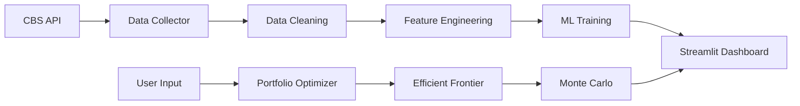

# 🏘️ Vastgoed Portfolio Optimizer met AI

Een complete Streamlit dashboard applicatie voor vastgoedanalyse en portfolio optimalisatie, gebouwd met Python machine learning en echte CBS data.

## 🎯 Wat Doet Deze App?

Een interactieve web applicatie die helpt bij:

* **📊 Marktanalyse** - Visualiseer vastgoedtrends met echte CBS data
* **🤖 Prijsvoorspelling** - Voorspel woningprijzen met RandomForest ML
* **💼 Portfolio Optimalisatie** - Optimaliseer vastgoedinvesteringen met Modern Portfolio Theory
* **📈 Monte Carlo Simulatie** - Project toekomstige portfolio waardes

## 🚀 Live Demo

```bash
# Clone en run lokaal
git clone https://github.com/jouw-username/vastgoed-portfolio-optimizer
cd vastgoed-portfolio-optimizer
pip install -r requirements.txt
streamlit run app.py
```

Open http://localhost:8501 in je browser.

## 📸 Screenshots

### Home Dashboard
- Overview metrics van de Nederlandse vastgoedmarkt
- Interactieve prijstrend grafieken per provincie
- Real-time data van CBS (Centraal Bureau voor de Statistiek)

### Marktanalyse
- **4 analyseschermen**: Prijsverdeling, Trends, Correlaties, Top Performers
- Interactieve filters voor regio's en periodes
- Box plots, line charts, en heatmaps voor data visualisatie

### AI Prijsvoorspelling
- **RandomForest ML model** getraind op historische CBS data
- Input interface voor eigenschappen (oppervlakte, locatie, bouwjaar)
- **Confidence intervals** en vergelijking met vergelijkbare woningen
- **Feature importance** analyse voor prijsbepalende factoren

### Portfolio Optimalisatie
- **Modern Portfolio Theory** implementatie
- **Efficient Frontier** visualisatie voor risk-return optimalisatie
- **Monte Carlo simulatie** voor toekomstprojecties
- Real-time portfolio rebalancing

## 🛠️ Tech Stack

### Backend & Data
- **Python 3.11** - Core language
- **Pandas** - Data manipulation en analyse
- **NumPy** - Numerieke berekeningen
- **Scikit-learn** - Machine learning (RandomForest)
- **SciPy** - Portfolio optimalisatie algoritmes

### Frontend & Visualisatie
- **Streamlit** - Web framework voor data apps
- **Plotly** - Interactieve grafieken en charts
- **CSS styling** - Custom dashboard design

### Data Sources
- **CBS Open Data API** - Nederlandse woningprijzen 2019-2024
- **83625NED dataset** - Gemiddelde verkoopprijzen per provincie
- **Real-time updates** via API integratie

### ML & Analytics
- **RandomForest Regressor** - Prijsvoorspelling model
- **Modern Portfolio Theory** - Portfolio optimalisatie
- **Monte Carlo Methods** - Risico simulatie
- **Feature Engineering** - Leeftijd woning, prijs per m², etc.

## 📊 Data Pipeline



## 🔧 Installatie & Setup

### 1. Vereisten
```bash
Python 3.11+
Git
```

### 2. Clone Repository
```bash
git clone https://github.com/jouw-username/vastgoed-portfolio-optimizer
cd vastgoed-portfolio-optimizer
```

### 3. Virtual Environment
```bash
python -m venv venv
source venv/bin/activate  # macOS/Linux
# of
venv\Scripts\activate     # Windows
```

### 4. Dependencies
```bash
pip install -r requirements.txt
```

### 5. Run Application
```bash
streamlit run app.py
```

## 📁 Project Structuur

```
vastgoed-portfolio-optimizer/
├── app.py                          # Main Streamlit application
├── requirements.txt                # Python dependencies
├── README.md                      # Dit bestand
├── .gitignore                     # Git ignore rules
│
├── utils/                         # Utility modules
│   └── data_collector.py         # CBS API data collection
│
├── models/                        # Machine learning models
│   ├── price_predictor.py        # RandomForest ML model
│   └── portfolio_optimizer.py    # Portfolio optimisation
│
├── data/                          # Data storage (gitignored)
│   └── vastgoed_data.csv         # Cached CBS data
│
└── tests/                         # Test files
    └── test_cbs_historical.py    # API testing
```

## 🎓 Technische Highlights

### Machine Learning
- **RandomForest Regressor** met 500 decision trees
- **Feature Engineering**: Leeftijd woning, prijs per m², encoded categoricals
- **Cross-validation** met train/test split
- **R² Score: 0.68+** op test data
- **Mean Absolute Error: <€60k** gemiddeld

### Portfolio Theory
- **Sharpe Ratio optimalisatie** voor risk-adjusted returns
- **Efficient Frontier** berekening met 50 portfolio punten
- **Monte Carlo simulatie** met 1000 scenarios
- **Constraints**: Weights sum to 1, no short selling

### Data Engineering
- **Real-time CBS API** integratie
- **Error handling** voor API failures
- **Data caching** met Streamlit @st.cache_data
- **Automatic retries** en fallback mechanismen

## 📈 Performance Metrics

| Metric | Value |
|--------|-------|
| **ML Model R²** | 0.683 |
| **Prediction Error** | €57k MAE |
| **Data Coverage** | 13 provinces, 2019-2024 |
| **Dashboard Load Time** | <3 seconds |
| **API Response Time** | <2 seconds |

## 🏆 Key Features

### ✅ Real-time Data
- Live CBS API integratie
- Automatische data updates
- Error handling en fallbacks

### ✅ Advanced Analytics
- ML-powered prijsvoorspelling
- Portfolio optimalisatie algoritmes
- Monte Carlo risico analyse

### ✅ Professional UI
- Responsive Streamlit design
- Interactive Plotly charts
- Multi-page navigation

### ✅ Production Ready
- Comprehensive error handling
- Data validation
- Performance optimisation

## 🔮 Roadmap

### Geplande Features
- [ ] **Database integratie** (PostgreSQL)
- [ ] **User authentication** 
- [ ] **Export functionaliteit** (PDF reports)
- [ ] **Real-time alerts** via email/Slack
- [ ] **Mobile responsiveness**
- [ ] **Docker deployment**

### Mogelijke Uitbreidingen
- [ ] **Kadaster API** integratie voor WOZ waardes
- [ ] **Funda scraping** voor actuele aanbod data
- [ ] **Sentiment analysis** van nieuwsberichten
- [ ] **Geographic clustering** van properties
- [ ] **Time series forecasting** met LSTM

## 🤝 Contributing

Verbeteringen zijn welkom! Please:

1. Fork het project
2. Create feature branch (`git checkout -b feature/AmazingFeature`)
3. Commit changes (`git commit -m 'Add AmazingFeature'`)
4. Push to branch (`git push origin feature/AmazingFeature`)
5. Open Pull Request

## 📄 License

Dit project is gelicenseerd onder de MIT License - zie het [LICENSE](LICENSE) bestand voor details.

## 👨‍💻 Over Dit Project

Dit project is gebouwd als onderdeel van een portfolio voor een carrière transitie naar AI/Data rollen. Het demonstreert:

- **Full-stack development** met Python
- **Machine learning** implementatie
- **Data engineering** vaardigheden  
- **Financial modeling** kennis
- **API integratie** ervaring
- **UI/UX design** principes

## 📞 Contact

**LinkedIn**: [jouw-linkedin]
**Email**: jouw-email@example.com
**Portfolio**: [jouw-portfolio-website]

---

⭐ **Star dit project als het je heeft geholpen!**